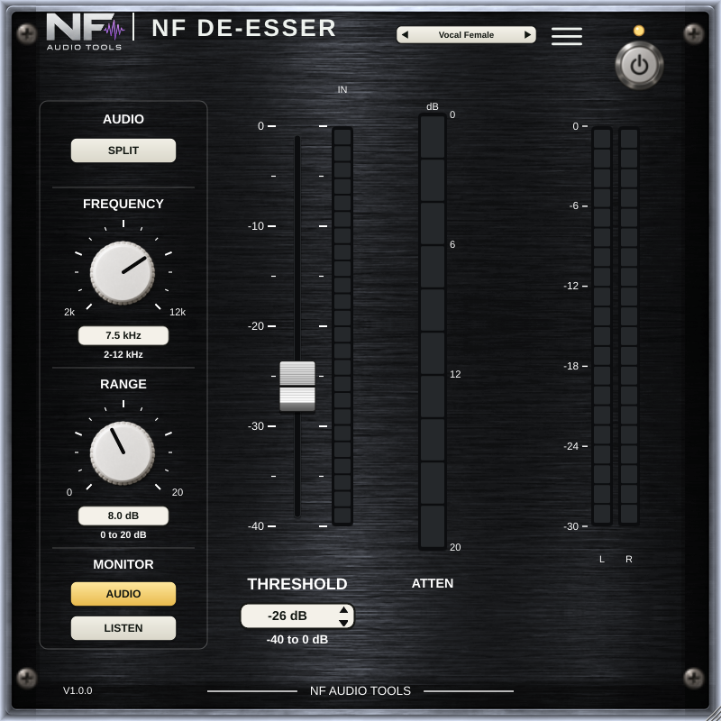

# NF De-Esser

Simple split-band de-esser by **NF Audio Tools** (Nenno Fernando) for vocals, drums and mixes. VST3, AU (macOS) and AAX (Pro Tools).

Layout inspired by classic de-esser plug-ins, in the NF look (with a **black brushed-steel** chassis, the owner's choice for this plug-in):
- **Left column:** **AUDIO** mode (**SPLIT**: only the sibilance band is turned down, **WIDE**: the whole signal is turned down), **FREQUENCY** (2-12 kHz,
  round knob with a value box) and **MONITOR** (**AUDIO** / **LISTEN**: Listen plays only the band the de-esser hears, to find the "s").
- **Range** (0..20 dB: the most it will ever turn down) is a round knob in the left column, like Frequency.
- **Threshold** (-40..0 dB) is the only fader, with an input meter beside it (what the detector hears); then the **ATTEN** meter (gain reduction)
  and L / R output level meters. There is no output gain control.
- Power and 11 factory presets (male / female / rock / pop / podcast / heavy voice, acoustic guitar, hi-hat, overheads, mix bus, master) plus save/load.

No latency.



## Build (local, no CI)
- macOS DMG (VST3 + AU + PACE-signed AAX): `bash Installer/macos/build_dmg.sh`
- Windows installer (VST3 + PACE-signed AAX): `.\Installer\Windows\build_windows_installer.ps1`

See `CLAUDE.md` for the rules (version, AAX SDK, signing).

## Tests
```
g++ -std=c++17 -Wall -Wextra Tests/DeEsserTests.cpp -o dsp_tests && ./dsp_tests
```

This plug-in is **square** (owner's design): it opens at 540 x 540 (resizable, always 1:1) and remembers the size you choose with the resize handle; double-click the NF logo to go back to 540 x 540. A small preset tab (prev / name / next) sits at the top right; the 3-line button holds About.
